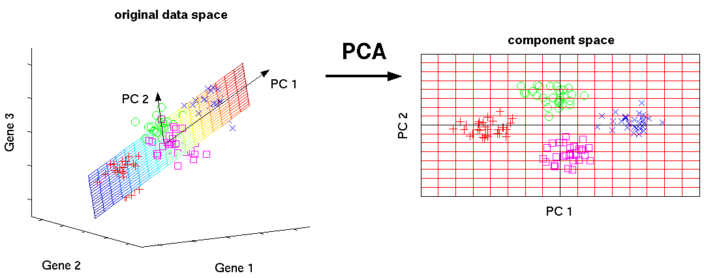
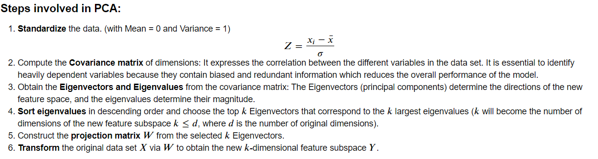

# Manual implementation of Principal Component Analysis (PCA) using Julia

**This project aims to visually differentiate good quality wines from the bad ones using K-means clustering but first using PCA as a preprocessing step for dimensionality reduction.**

## What is PCA and what is the need for it?

High dimensional data is extremely complex to process due to inconsistencies in the features which increase the computational time and it makes data processing and EDA more convoluted.

**Principal Component Analysis**, or PCA, is a dimensionality-reduction method that is often used to reduce the dimensions of large data sets, by transforming a large set of variables into a smaller one that enables us to identify correlations and patterns in a data set without loss of any important information.

Reducing the number of variables of a data set naturally comes at the expense of accuracy, but the trick in dimensionality reduction is to **trade a little accuracy for simplicity**. Smaller data sets are easier to explore & visualize, and make analyzing data much simpler and faster for machine learning algorithms without extraneous variables to process.

## Goal
It is hoped, in general, that most of the variation in  x  will be accounted for by  𝑚  Principal Components where  𝑚<<𝑝 .

### An Example: Differentiate good quality wine from the bad one

**Wine** (from Latin vinum) is an alcoholic beverage made from grapes, generally Vitis vinifera, fermented without the addition of sugars, acids, enzymes, water, or other nutrients.

Yeast consumes the sugar in the grapes and converts it to ethanol and carbon dioxide. Different varieties of grapes and strains of yeasts produce different styles of wine. These variations result from the complex interactions between the biochemical development of the grape, the reactions involved in fermentation, the terroir, and the production process. Many countries enact legal appellations intended to define styles and qualities of wine. These typically restrict the geographical origin and permitted varieties of grapes, as well as other aspects of wine production. Wines not made from grapes include rice wine and fruit wines such as plum, cherry, pomegranate and elderberry. Wine has been produced for thousands of years. The earliest known traces of wine are from China , Georgia ,Iran ,and Sicily.

> Dataset Source: https://github.com/nthun/courses-multivariate-statistics-in-R-2017-fall/blob/master/datasets%2Fwines.csv

**Physicohemical Properties provided in the dataset:**
- Volatile Acidity: The amount of acetic acid in wine, which at high levels can lead to an unpleasant, vinegar taste (acetic acid - g / dm^3)
- pH: Describes how acidic or basic a wine is on a scale from 0 (very acidic) to 14 (very basic)
- Alcohol: The percent alcohol content of the wine (% by volume) 
- Quality (based on sensory data): Quality label(score between 3 to 8) 

## Result

**We can see from the above plot that there exists two classes i.e. bad quality wine and the good quality wine clearly separated.**
